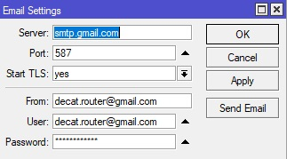

# Mikrotik Auto Backup and E-Mail Backup File
Auto backup on mikrotik RouterOS and E-mail the backup file
1. Go to router ` Tools → Email ` and set valid email for router send Email

<p align="center"></p>

2. copy AutoBakcup script to your router
3. Go to `Terminal` and import script
```bash script
import file=AutoBakcup.rsc
```
4. for Schedule the script copy this command to the `Terminal`
```bash script
/system scheduler
add interval=4w2d name="Run AutoBackup" on-event=AutoBackup policy=\
    ftp,read,write,policy,test,password,sniff,sensitive,romon start-time=startup
```
> last test this script on RoS 6.49.5

**Enjoy the Code !**
